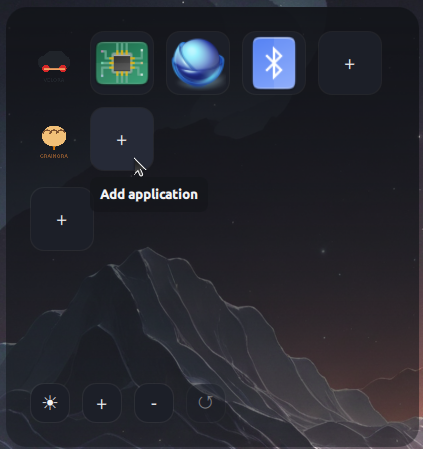
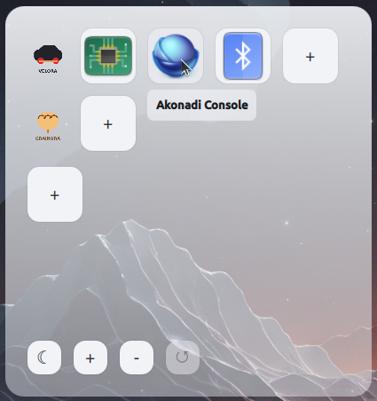

# ClientDeck

  
  

ClientDeck exists to solve one problem: keeping several clients' work cleanly
separated on a single machine without juggling logins, VMs, or containers for
every little task.

Freelancers and consultants who work with multiple clients often end up with
each client's terminal sessions, editor windows, and tools tangled together
on one desktop — a mistake waiting to happen when credentials, code, or
config for one client could leak into another's context. The conventional
fixes (a VM per client, a container per client) are heavyweight for what's
usually just "run these few apps as a different, isolated Linux user."

ClientDeck takes that lighter path: each client gets their own dedicated
Linux user account, and a single always-available launcher window gives you
one row per client with square buttons for whatever apps that client's work
needs — a terminal, an editor, whatever. Pressing a button impersonates that
client's user and launches the app inside their isolated environment. There
is nothing built in beyond that: every app on every row was added by hand,
so the deck only ever contains exactly what a given client's work requires.

The result is a quick-launcher that makes "which client am I working as
right now" an explicit, visible choice — a button on a themed dock — rather
than an implicit, error-prone habit.
